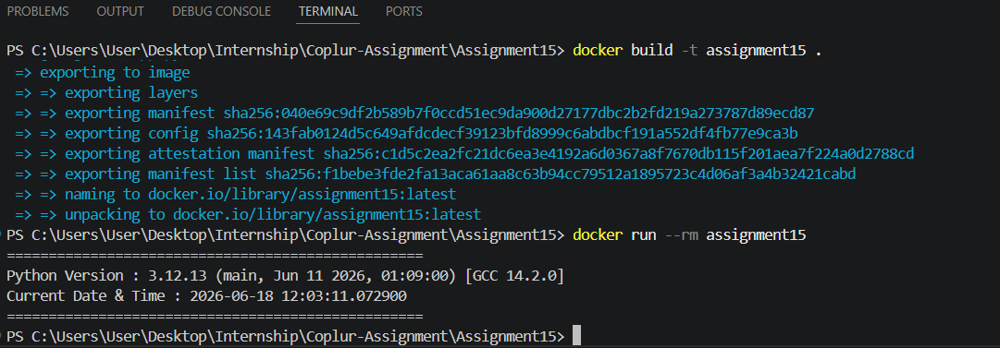

# Dockerized Python Application

## Objective

This project demonstrates a simple Dockerized Python application using the official Python 3.12 slim image.

The application prints:

- Python version running inside the container
- Current date and time

---

## Project Structure

```text
docker-python-app/
│
├── app.py
├── Dockerfile
├── requirements.txt
├── README.md
└── screenshot.png
```

---

## Build Docker Image

```bash
docker build -t python-version-app .
```

---

## Run Docker Container

```bash
docker run --rm python-version-app
```

---

## Sample Output

```text
==================================================
Python Version : 3.12.x (main, ...)
Current Date & Time : 2026-06-18 12:45:20.123456
==================================================
```

---

## Screenshot

Add your terminal screenshot as:

`screenshot.png`

Example:



---

## Docker Hub (Optional)

```bash
docker tag python-version-app username/python-version-app

docker push username/python-version-app
```

---

## Author

Mohit Prajapat